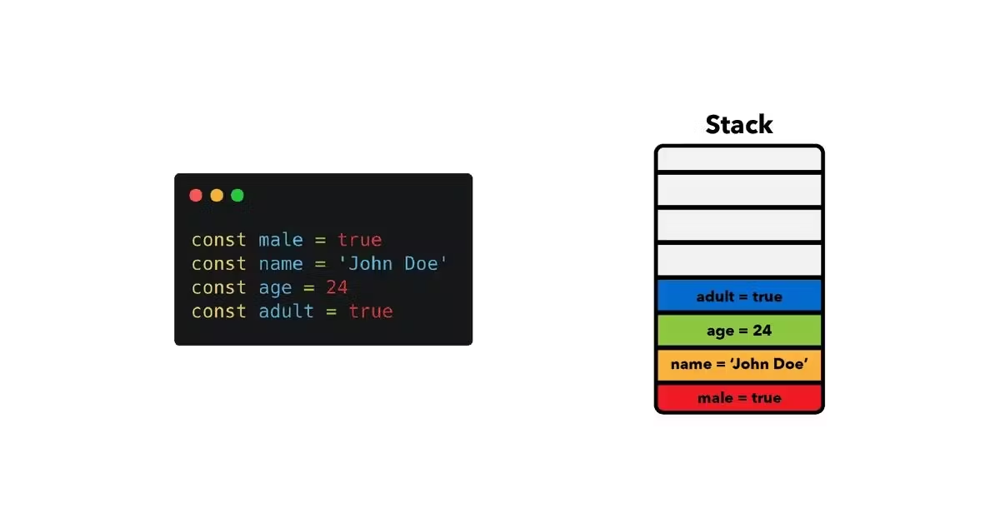

## JavaScript engine storages (stack and heap memory)

The next question is where does JavaScript store this data?

JavaScript engines store their data in two places; the Stack Memory and the Heap Memory.

1. **Stack Memory** - Static Memory allocation: is a type of data structure that uses the Last-in-First-out (LIFO) manner, to store static data. Because of its fixed size, known during compile time by the engine, it is static. Static data in JavaScript comprises references to objects and functions as well as primitive values such as "strings, number, Boolean, null, undefined, symbol, BigInt."
It allocates a set amount of memory for every value because it has a defined size that won't change.
Stack overflow is what happens when the stack exceeds its maximum size (for example when we are stuck in an infinite loop).

2. **Heap** – Dynamic memory allocation: Heap is another way of storing data in memory. This is used for storing objects (in this context here, our objects mean both object and functions) in memory.

The JavaScript heap doesn’t allocate a fixed amount of memory like the stack does, instead, it allocates more space during run time i.e the size is known at run time and there is no limit for its object memory.